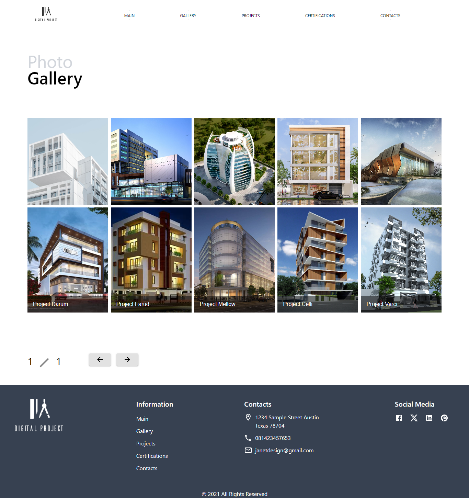

# Arkitek - Architecture Company Website 

Arkitek is the Frontend of a Architecture Design Company Website that servers as a company portfolio showcasing different building that was designed by the company and provides a way to contact for potential client.

Built using React with Vite, Tailwind and React Router for pages management. design is based on Padre Loo Website of Architects Web Design on Figma

## Showcase

### Arkitek Landing Page

### Arkitek Gallery Page

### Arkitek Projects Page

